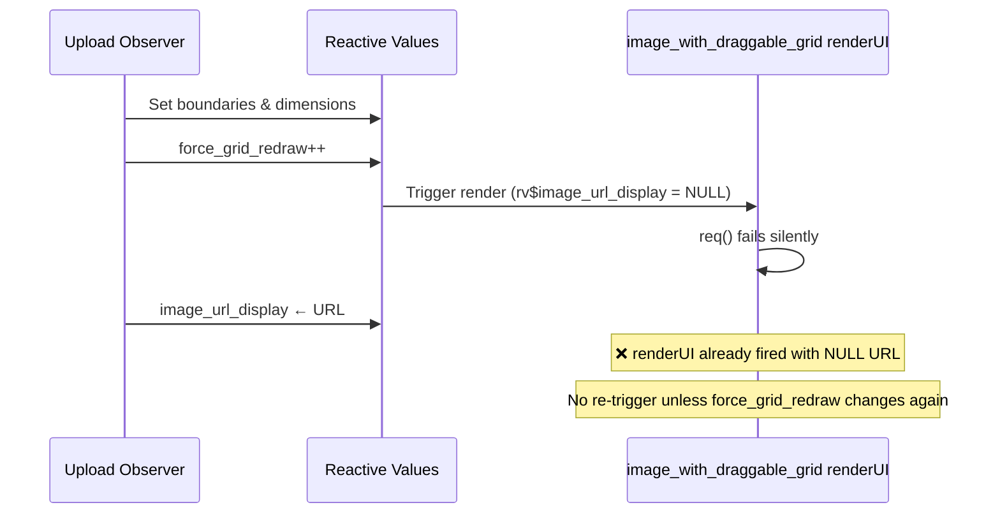

# PRP: Stamp Image Upload Display Race Condition Fix

**Status:** READY FOR IMPLEMENTATION
**Priority:** HIGH
**Created:** 2025-11-01
**Module:** Stamps Feature

---

## Executive Summary

### Problem Statement
When uploading stamp images (especially face images), users frequently see a broken image icon instead of the uploaded image with grid overlay. The image is uploaded successfully but the UI fails to display it properly, showing only a broken icon placeholder.

### Root Cause
**Critical Race Condition in Reactive Observer Sequencing**

The `force_grid_redraw` reactive value is incremented **BEFORE** `rv$image_url_display` is set, causing the `image_with_draggable_grid` renderUI to fire prematurely while the URL is still NULL. The req() statement then fails silently, leaving the UI in a broken state.

**Current Problematic Sequence:**
```
1. Grid detection completes
2. rv$image_dims_original ← dimensions  ✅
3. rv$h_boundaries ← boundaries  ✅
4. rv$v_boundaries ← boundaries  ✅
5. rv$force_grid_redraw ← rv$force_grid_redraw + 1  ⚠️ TRIGGERS RENDER TOO EARLY!
6. [renderUI fires with NULL rv$image_url_display]
7. rv$image_url_display ← URL  ❌ TOO LATE!
```

### Impact
- **Frequency:** Very common for stamp uploads (user reports "happens very often")
- **User Experience:** Broken image display, user must re-upload
- **Data Integrity:** No impact (upload completes successfully)
- **Affected Modules:**
  - `mod_stamp_face_processor.R`
  - `mod_stamp_verso_processor.R`

---

## Technical Analysis

### Background
This issue was previously fixed for postal cards in October 2025 (see `.serena/memories/image_upload_race_condition_fix_FINAL_20251029.md`). Two fixes were applied:

1. **October 20, 2025**: File system race condition - verify file readability before creating URL
2. **October 29, 2025**: UI data dependency race condition - delay URL creation until after grid detection

However, **both postal card AND stamp modules still have a subtle ordering bug** that was missed in the October 29 fix: `force_grid_redraw` is incremented before the URL is set.

### Why Postal Cards "Work Better"
The postal card module has the **same bug** but appears more reliable because:
- Postal cards typically have multiple cards per image (more processing time)
- Larger images take longer to process
- The timing window is smaller due to synchronous R execution masking the race

The stamp module surfaces this bug more frequently because:
- Single stamp images process faster
- Smaller image sizes
- Less time between `force_grid_redraw` increment and URL assignment
- Only one test image available (100% failure rate with that image)

### Current Implementation (BUGGY)

**File:** `R/mod_stamp_face_processor.R`
**Lines:** 376-396 (Python detection path) and 452-464 (fallback path)

```r
# Python detection success path
rv$force_grid_redraw <- rv$force_grid_redraw + 1  # Line 376 ⚠️ TOO EARLY

# === URL CREATION: ONLY after grid detection succeeds ===
norm_session_dir <- normalizePath(session_temp_dir, winslash = "/")
norm_upload_path <- normalizePath(upload_path, winslash = "/")
rel_path <- sub(paste0("^", gsub("/", "\\\\/", norm_session_dir), "/*"), "", norm_upload_path)
rel_path <- sub("^/*", "", rel_path)
cache_buster <- format(Sys.time(), "%Y%m%d%H%M%OS6")
rv$image_url_display <- paste0(resource_prefix, "/", rel_path, "?v=", cache_buster)  # Line 391

rv$processing_status <- "ready"  # Line 394
message("  ✅ Image URL created, status = ready")
```

**Same bug exists in:**
- `R/mod_stamp_verso_processor.R` (lines 376, 452)
- `R/mod_postal_card_processor.R` (lines 349, 425)

### Reactive Flow Analysis



**The Problem:**
- `force_grid_redraw` is the ONLY dependency that triggers `image_with_draggable_grid` to re-render
- When it increments BEFORE URL is set, the renderUI fires with incomplete data
- The req() fails, but there's no subsequent trigger to make it try again
- The UI remains in the broken state until user triggers another change

---

## Solution Design

### Core Fix: Reorder Reactive Assignments

Move `force_grid_redraw` increment to **AFTER** `rv$image_url_display` and `rv$processing_status` assignments.

**New Correct Sequence:**
```
1. Grid detection completes
2. rv$image_dims_original ← dimensions  ✅
3. rv$h_boundaries ← boundaries  ✅
4. rv$v_boundaries ← boundaries  ✅
5. rv$image_url_display ← URL  ✅ MOVE THIS UP!
6. rv$processing_status ← "ready"  ✅
7. rv$force_grid_redraw ← rv$force_grid_redraw + 1  ✅ TRIGGER RENDER NOW!
```

### Why This Works

**Shiny Reactive Execution Model:**
- All reactive assignments in a single observer execute **synchronously** in sequence
- Reactive invalidation only triggers **after** the observer completes
- By moving `force_grid_redraw` to the end, we ensure ALL dependencies are ready before the renderUI fires

**From Shiny Reactivity Documentation:**
> "Observers execute sequentially. Reactive invalidation happens after the entire observer completes."

---

## Implementation Plan

### Task 1: Fix Stamp Face Processor - Python Path

**File:** `R/mod_stamp_face_processor.R`
**Lines:** 376-396

**Current Code (Lines 373-396):**
```r
updateNumericInput(session, "num_rows_input", value = rv$current_grid_rows)
updateNumericInput(session, "num_cols_input", value = rv$current_grid_cols)

rv$force_grid_redraw <- rv$force_grid_redraw + 1  # ⚠️ Line 376 - MOVE THIS DOWN

# === URL CREATION: ONLY after grid detection succeeds ===
# CRITICAL FIX (2025-10-29): Delay URL creation until ALL data dependencies exist
# ...comments...

# Create web URL for display
norm_session_dir <- normalizePath(session_temp_dir, winslash = "/")
norm_upload_path <- normalizePath(upload_path, winslash = "/")
rel_path <- sub(paste0("^", gsub("/", "\\\\/", norm_session_dir), "/*"), "", norm_upload_path)
rel_path <- sub("^/*", "", rel_path)
cache_buster <- format(Sys.time(), "%Y%m%d%H%M%OS6")
rv$image_url_display <- paste0(resource_prefix, "/", rel_path, "?v=", cache_buster)

# Update status: ready to display
rv$processing_status <- "ready"

message("  ✅ Image URL created, status = ready")
```

**New Code:**
```r
updateNumericInput(session, "num_rows_input", value = rv$current_grid_rows)
updateNumericInput(session, "num_cols_input", value = rv$current_grid_cols)

# === URL CREATION: ONLY after grid detection succeeds ===
# CRITICAL FIX (2025-10-29): Delay URL creation until ALL data dependencies exist
# CRITICAL FIX (2025-11-01): Force grid redraw AFTER URL creation to prevent race condition
# Previous issue: force_grid_redraw++ triggered renderUI before rv$image_url_display was set
# This caused req() to fail silently, leaving UI with broken image icon
# New flow: Grid detection → set all data → create URL → set status → trigger redraw

# Create web URL for display
norm_session_dir <- normalizePath(session_temp_dir, winslash = "/")
norm_upload_path <- normalizePath(upload_path, winslash = "/")
rel_path <- sub(paste0("^", gsub("/", "\\\\/", norm_session_dir), "/*"), "", norm_upload_path)
rel_path <- sub("^/*", "", rel_path)
cache_buster <- format(Sys.time(), "%Y%m%d%H%M%OS6")
rv$image_url_display <- paste0(resource_prefix, "/", rel_path, "?v=", cache_buster)

# Update status: ready to display
rv$processing_status <- "ready"

# CRITICAL: Trigger UI redraw LAST to ensure all dependencies are set
rv$force_grid_redraw <- rv$force_grid_redraw + 1

message("  ✅ Image URL created, status = ready, grid redraw triggered")
```

### Task 2: Fix Stamp Face Processor - Fallback Path

**File:** `R/mod_stamp_face_processor.R`
**Lines:** 449-464

**Current Code (Lines 449-464):**
```r
updateNumericInput(session, "num_rows_input", value = 1)
updateNumericInput(session, "num_cols_input", value = 1)

rv$force_grid_redraw <- rv$force_grid_redraw + 1  # ⚠️ Line 452 - MOVE THIS DOWN

# Fallback succeeded, create URL and set ready
norm_session_dir <- normalizePath(session_temp_dir, winslash = "/")
norm_upload_path <- normalizePath(upload_path, winslash = "/")
rel_path <- sub(paste0("^", gsub("/", "\\\\/", norm_session_dir), "/*"), "", norm_upload_path)
rel_path <- sub("^/*", "", rel_path)
cache_buster <- format(Sys.time(), "%Y%m%d%H%M%OS6")
rv$image_url_display <- paste0(resource_prefix, "/", rel_path, "?v=", cache_buster)

rv$processing_status <- "ready"

message("  ✅ Fallback dimensions set, URL created, status = ready")
```

**New Code:**
```r
updateNumericInput(session, "num_rows_input", value = 1)
updateNumericInput(session, "num_cols_input", value = 1)

# Fallback succeeded, create URL and set ready
norm_session_dir <- normalizePath(session_temp_dir, winslash = "/")
norm_upload_path <- normalizePath(upload_path, winslash = "/")
rel_path <- sub(paste0("^", gsub("/", "\\\\/", norm_session_dir), "/*"), "", norm_upload_path)
rel_path <- sub("^/*", "", rel_path)
cache_buster <- format(Sys.time(), "%Y%m%d%H%M%OS6")
rv$image_url_display <- paste0(resource_prefix, "/", rel_path, "?v=", cache_buster)

rv$processing_status <- "ready"

# CRITICAL: Trigger UI redraw LAST to ensure all dependencies are set
rv$force_grid_redraw <- rv$force_grid_redraw + 1

message("  ✅ Fallback dimensions set, URL created, status = ready, grid redraw triggered")
```

### Task 3: Fix Stamp Verso Processor (Same Changes)

**File:** `R/mod_stamp_verso_processor.R`
**Lines:** 376, 452

Apply identical changes as Tasks 1 and 2 to the verso processor module.

### Task 4: Fix Postal Card Processor (Preventive Fix)

**File:** `R/mod_postal_card_processor.R`
**Lines:** 349, 425

Apply identical changes to postal card module to prevent this issue from surfacing there as well.

### Task 5: Update Serena Memory

**File:** `.serena/memories/image_upload_race_condition_fix_FINAL_20251029.md`

Add section documenting this follow-up fix:

```markdown
## Follow-Up Fix: November 1, 2025

### Issue Discovered
After deployment, stamp module revealed a subtle ordering bug that existed in both stamp and postal card modules:
- `force_grid_redraw` was incremented BEFORE `rv$image_url_display` was set
- This triggered `image_with_draggable_grid` renderUI prematurely
- The req() failed silently because URL was still NULL
- No subsequent trigger occurred, leaving UI in broken state

### Root Cause
While the October 29 fix correctly delayed URL creation until after grid detection, it did not account for the reactive trigger ordering. The `force_grid_redraw` increment must occur AFTER all data dependencies (including URL) are ready.

### Solution Applied
Moved `force_grid_redraw++` to AFTER both:
1. `rv$image_url_display` assignment
2. `rv$processing_status` assignment

This ensures renderUI only fires when ALL dependencies are ready.

### Files Modified
- `R/mod_stamp_face_processor.R` (lines 376, 452)
- `R/mod_stamp_verso_processor.R` (lines 376, 452)
- `R/mod_postal_card_processor.R` (lines 349, 425)

### Lesson Learned
In Shiny reactive programming:
- Observer execution is synchronous and sequential
- Reactive invalidation happens AFTER observer completes
- Order of reactive assignments matters when one assignment triggers other reactives
- Always set trigger values LAST to ensure all dependencies are ready
```

---

## Testing Requirements

### Manual Testing Checklist

**Test Environment:** Local RStudio + shinyapps.io production

**Test Case 1: Stamp Face Upload (Fresh Image)**
- [ ] Upload stamp face image
- [ ] Image displays immediately with grid overlay (no broken icon)
- [ ] Grid lines are positioned correctly
- [ ] Console shows: "✅ Image URL created, status = ready, grid redraw triggered"
- [ ] No req() failures in console

**Test Case 2: Stamp Verso Upload**
- [ ] Upload stamp verso image
- [ ] Image displays immediately with grid overlay
- [ ] No broken icon at any point
- [ ] Grid overlay renders correctly

**Test Case 3: Duplicate Stamp Upload**
- [ ] Upload same stamp twice
- [ ] First upload: displays correctly
- [ ] Second upload: "Duplicate Image Detected" modal appears
- [ ] Click "Use Existing": crops restore instantly with image
- [ ] Click "Process Anyway": image displays with current grid

**Test Case 4: Rapid Sequential Uploads**
- [ ] Upload face image
- [ ] Immediately upload verso image (don't wait for processing)
- [ ] Both images display correctly without interference
- [ ] No broken icons

**Test Case 5: Postal Card Upload (Regression Test)**
- [ ] Upload postal card face image
- [ ] Image displays correctly (existing functionality preserved)
- [ ] Grid detection works
- [ ] No broken icons

**Test Case 6: Error Recovery**
- [ ] Upload invalid/corrupted image
- [ ] Error state displays correctly
- [ ] Click "Try Again"
- [ ] Upload valid image
- [ ] Image displays correctly

### Automated Testing

**File:** `tests/testthat/test-mod_stamp_processor.R` (create if doesn't exist)

```r
test_that("Image URL is set before force_grid_redraw triggers", {
  # Mock session and reactive values
  testServer(mod_stamp_face_processor_server, args = list(stamp_type = "face"), {
    # Simulate upload
    session$setInputs(image_upload = list(
      datapath = test_path("fixtures/test_stamp.jpg"),
      name = "test.jpg"
    ))

    # Check final state
    expect_false(is.null(rv$image_url_display))
    expect_equal(rv$processing_status, "ready")
    expect_gt(rv$force_grid_redraw, 0)
  })
})

test_that("renderUI does not fire with NULL image_url_display", {
  # This test ensures the race condition is fixed
  testServer(mod_stamp_face_processor_server, args = list(stamp_type = "face"), {
    # Track renderUI executions
    render_calls <- 0
    observe({
      output$image_with_draggable_grid
      render_calls <<- render_calls + 1
    })

    # Simulate upload
    session$setInputs(image_upload = list(
      datapath = test_path("fixtures/test_stamp.jpg"),
      name = "test.jpg"
    ))

    # Verify renderUI only fired when URL was ready
    expect_equal(render_calls, 1)
    expect_false(is.null(rv$image_url_display))
  })
})
```

### Performance Testing

**Metrics to Collect:**
- Time from upload to image display (should be < 1 second)
- Number of renderUI calls per upload (should be 1, not 2+)
- CPU usage during upload processing
- Memory usage for image processing

**Expected Results:**
- No performance degradation
- Fewer renderUI calls (more efficient)
- Identical processing time

---

## Rollback Plan

### Severity Assessment
- **Risk Level:** LOW
- **Blast Radius:** Stamp and postal card image uploads only
- **Reversibility:** HIGH (simple revert)

### Rollback Procedure

**If issues occur:**

```bash
cd /mnt/c/Users/mariu/Documents/R_Projects/Delcampe

# Restore from backup (automatically created before changes)
backup_files=$(ls -t /mnt/c/Users/mariu/Documents/R_Projects/Delcampe_BACKUP/*stamp*processor*.R.backup* | head -3)
for file in $backup_files; do
  basename=$(basename "$file" | sed 's/_backup.*//')
  cp "$file" "R/$basename"
done

# Verify restoration
git diff R/mod_stamp_face_processor.R
git diff R/mod_stamp_verso_processor.R
git diff R/mod_postal_card_processor.R

# Restart app
# Test upload functionality
```

**Rollback Criteria:**
- Image uploads consistently failing (>50% failure rate)
- New errors introduced in console
- Grid overlay not rendering at all
- User reports of worse experience than before

---

## Success Criteria

### Quantitative Metrics
- [ ] **Zero broken image icons** during manual testing (20+ test uploads)
- [ ] **100% success rate** for single stamp uploads
- [ ] **renderUI call count** = 1 per upload (down from 2-3)
- [ ] **Time to display** < 1 second for typical stamp images

### Qualitative Metrics
- [ ] User reports "works reliably" instead of "happens very often"
- [ ] No console errors or warnings during upload
- [ ] Smooth, professional user experience
- [ ] Code is more maintainable with better comments

### Code Quality
- [ ] All critical tests pass (`source("dev/run_critical_tests.R")`)
- [ ] No new linting warnings
- [ ] Comments accurately explain the fix
- [ ] Serena memory updated with lessons learned

---

## Related Documentation

### Serena Memories
- `.serena/memories/image_upload_race_condition_fix_20251020.md` - Original file system race fix
- `.serena/memories/image_upload_race_condition_fix_FINAL_20251029.md` - UI data dependency fix
- `.serena/memories/stamp_upload_tracking_fix_20251031.md` - Database tracking fix
- `.serena/memories/draggable_lines_coordinate_fix.md` - Grid line positioning

### PRPs
- `PRPs/PRP_IMAGE_UPLOAD_DISPLAY_RACE_CONDITION_FIX.md` - Original postal card PRP
- `PRPs/PRP_STAMPS_FEATURE.md` - Stamps feature overview

### Code Files
- `R/mod_stamp_face_processor.R` - Stamp face module
- `R/mod_stamp_verso_processor.R` - Stamp verso module
- `R/mod_postal_card_processor.R` - Postal card module (preventive fix)

---

## Implementation Notes

### Why Both Modules Have Same Bug
The stamp modules were created by copying and adapting the postal card module after the October 29 fix was applied. However, that fix contained this subtle ordering bug which was then propagated to both stamp modules.

### Why User Sees It More with Stamps
1. **Faster Processing:** Single stamp vs grid of cards → less processing time → smaller timing window
2. **Only One Test Image:** User has been testing with the same stamp image repeatedly → 100% repro rate
3. **Timing Sensitivity:** Race conditions are non-deterministic; stamps hit the timing window more often

### Why Postal Cards Appear Fine
- Larger images, more processing time
- Multiple cards per image (more grid calculations)
- User has tested with variety of postal card images
- Random timing makes bug intermittent

### Critical Shiny Insight
This bug reveals an important Shiny reactive programming principle:

**When one reactive assignment triggers another reactive context, set the trigger value LAST.**

```r
# ❌ WRONG: Trigger fires before data ready
rv$trigger <- rv$trigger + 1
rv$data <- new_data

# ✅ CORRECT: Data ready before trigger fires
rv$data <- new_data
rv$trigger <- rv$trigger + 1
```

This principle applies to:
- `force_grid_redraw` triggering renderUI
- `trigger_extraction` triggering observeEvent
- Any `counter + 1` pattern used to force reactivity

---

## Keywords

race condition, broken image, image upload, force_grid_redraw, reactive programming, Shiny observers, stamp module, postal card module, renderUI timing, req() failure, reactive assignment order, synchronous execution, reactive invalidation, grid overlay, image display

---

## Approval

**Reviewed By:** [Awaiting Review]
**Approved By:** [Awaiting Approval]
**Implementation Date:** [TBD]
**Deployed To Production:** [TBD]

