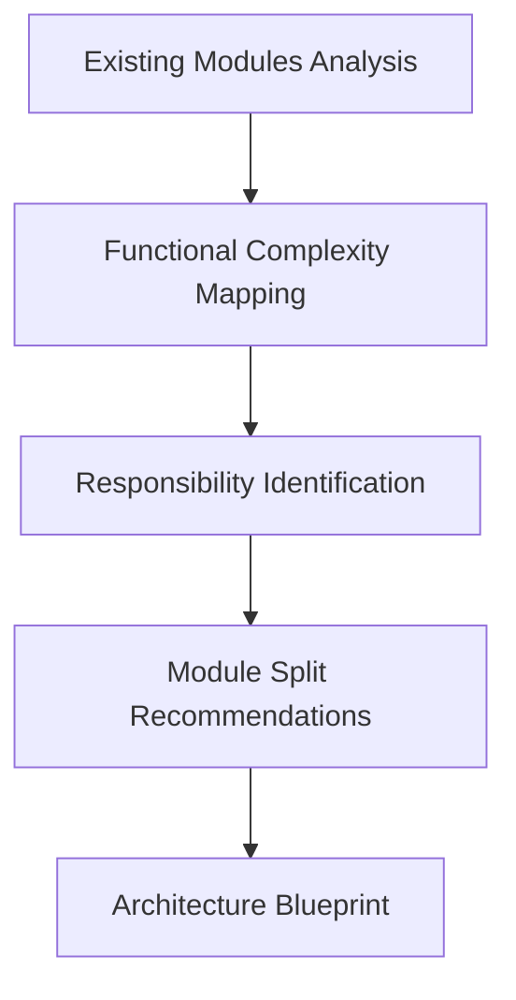
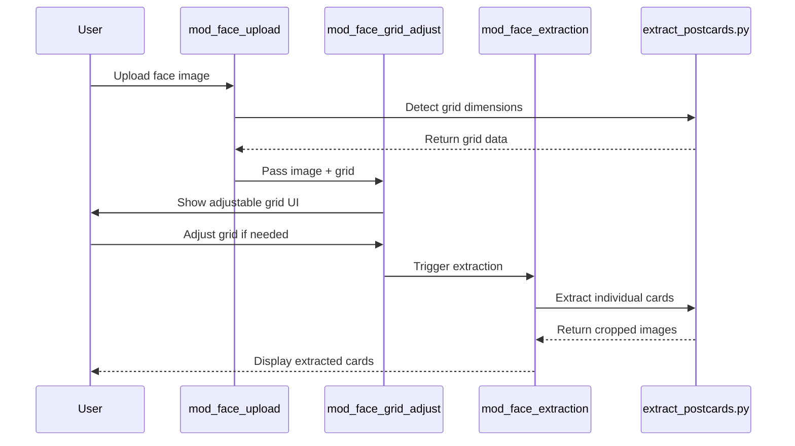
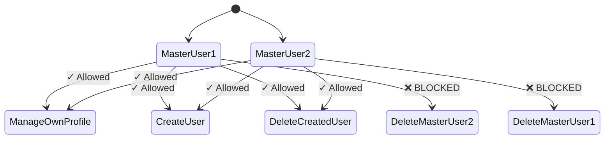
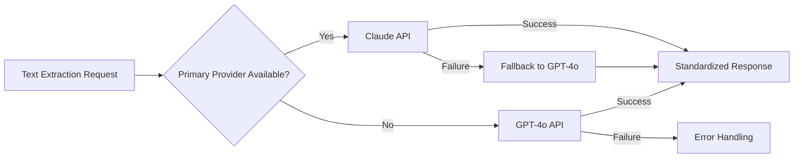
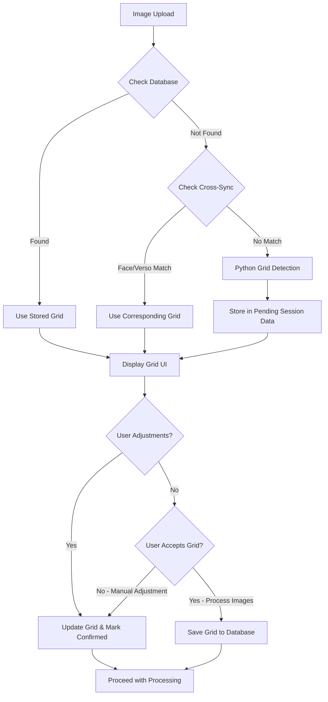
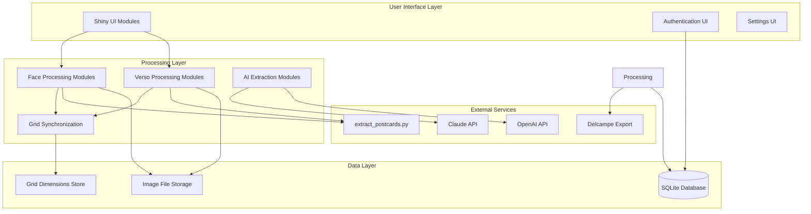
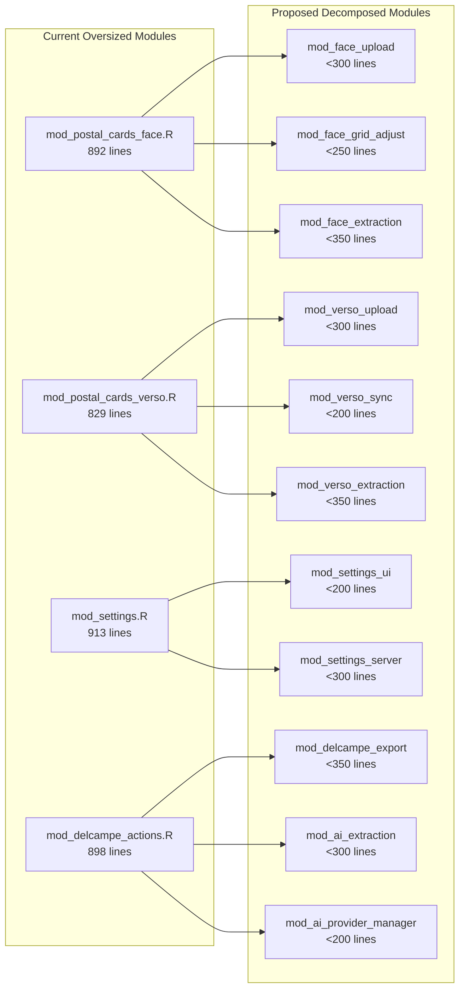

# Delcampe Postal Card Processor - Architectural Analysis & Rebuild PRD

**Version:** 1.0
**Date:** 2025-01-17
**Project Type:** Architectural Refactoring & Enhancement

---

## Executive Summary

This PRD outlines the comprehensive architectural analysis and intelligent rebuild of the Delcampe Postal Card Processor, a production-grade R Shiny application for digitizing and processing postal card collections for auction house operations. The project involves analyzing existing oversized modules (913-829 lines each), discovering optimal Golem-compliant architecture, and implementing clean, maintainable modules with preserved functionality.

**Key Objectives:**
- Transform 4 oversized modules (913-829 lines) into focused, single-responsibility components (<400 lines each)
- Preserve battle-tested Python integration and master user authentication constraints
- Implement intelligent grid detection with cross-sync capabilities
- Enhance multi-AI provider support with fallback mechanisms
- Ensure production-ready Golem compliance with comprehensive testing

---

## Problem Statement & Solution

### Current State Analysis

**Critical Issues Identified:**
- **Oversized Modules**: 4 modules exceed 400-line limit (mod_settings.R: 913 lines, mod_delcampe_actions.R: 898 lines, mod_postal_cards_face.R: 892 lines, mod_postal_cards_verso.R: 829 lines)
- **Architecture Debt**: Monolithic modules mixing UI, server logic, and business functions
- **Maintenance Risk**: Complex interdependencies making updates and testing difficult
- **Golem Non-Compliance**: Structure doesn't fully leverage Golem best practices

**Preserved Assets:**
- **Battle-Tested Python Integration**: `extract_postcards.py` with proven CV2-based grid detection
- **Master User Authentication**: Critical constraint preventing mutual deletion of master users
- **Working Grid Synchronization**: Smart detection priority (database → cross-sync → Python → user adjustment)
- **Test Images**: Validated `test_face.jpg` and `test_verso.jpg` for comprehensive testing

### Solution Architecture

Transform the existing monolithic structure into a modular, Golem-compliant architecture with intelligent module discovery based on actual functionality analysis.

---

## Market & Technical Research Findings

### Market Context

**Postal Automation Software Market (2025)**
- Market size: $1.68B by 2032 (7.1% CAGR)
- Key drivers: E-commerce growth, AI/ML integration, automation efficiency
- Specialized auction software: $3.2B by 2033 (9.5% CAGR)
- Niche collectibles market showing strong demand for specialized tools

**Delcampe Competitive Landscape**
- **Primary Competitors**: eBay, HipStamp, stamps2Go
- **Delcampe Advantages**: Superior material availability, international support, specialized tools
- **Market Position**: Leading collectibles marketplace with auction house integration
- **Technical Gap**: Limited automation tools for bulk processing

### Technical Foundation

**Golem Framework (2025 Best Practices)**
- **Version**: 0.5.1.9011 with enhanced module architecture
- **Key Principles**: Package structure, modular design, production-grade deployment
- **Module Strategy**: Start modular from beginning, numbered by application flow
- **File Organization**: `app_*`, `fct_*`, `mod_*` pattern with clear separation

---

## User Stories & Requirements

### Epic 1: Module Architecture Discovery & Implementation

#### Story 1.1: Intelligent Module Analysis
**As a** development team
**I want** automated analysis of existing module complexity
**So that** I can discover optimal splitting strategies based on actual functionality

**Acceptance Criteria:**
- [ ] Analyze all existing modules for line count and functional complexity
- [ ] Identify distinct responsibilities within oversized modules
- [ ] Map reactive dependencies and data flows
- [ ] Generate splitting recommendations with clear boundaries



#### Story 1.2: Face Processing Module Decomposition
**As a** developer
**I want** the 892-line face processing module split into focused components
**So that** each module has a single responsibility and is maintainable

**Acceptance Criteria:**
- [ ] Split into: mod_face_upload, mod_face_grid_adjust, mod_face_extraction
- [ ] Preserve all existing functionality including grid detection
- [ ] Maintain Python integration patterns exactly as implemented
- [ ] Each module under 400 lines with comprehensive tests



#### Story 1.3: Verso Processing Module Decomposition
**As a** developer
**I want** the 829-line verso processing module split with cross-sync capabilities
**So that** verso processing leverages face grid dimensions intelligently

**Acceptance Criteria:**
- [ ] Split into: mod_verso_upload, mod_verso_sync, mod_verso_extraction
- [ ] Implement cross-sync with face grid dimensions
- [ ] Preserve grid detection priority logic (database → cross-sync → Python)
- [ ] Maintain all existing verso-specific functionality

### Epic 2: Authentication & User Management Enhancement

#### Story 2.1: Master User Constraint Preservation
**As a** system administrator
**I want** master user deletion constraints preserved exactly
**So that** system integrity is maintained with protected master accounts

**Acceptance Criteria:**
- [ ] Master users cannot delete each other (critical constraint)
- [ ] Master users can manage their own credentials and created users
- [ ] Authentication system split from oversized modules
- [ ] Comprehensive testing of constraint enforcement



### Epic 3: AI Integration & Provider Management

#### Story 3.1: Multi-AI Provider Architecture
**As a** user
**I want** support for multiple AI providers with automatic fallback
**So that** text extraction is reliable and not dependent on single provider

**Acceptance Criteria:**
- [ ] Support Claude and GPT-4o providers
- [ ] Implement automatic fallback mechanisms
- [ ] Consistent extraction interface regardless of provider
- [ ] User/admin selection of preferred models



### Epic 4: Grid Detection & Synchronization

#### Story 4.1: Smart Grid Detection Priority System
**As a** user
**I want** intelligent grid detection that learns from previous processing
**So that** I don't have to manually adjust grids for similar images

**Acceptance Criteria:**
- [ ] Priority: Database → Cross-sync → Python detection → User confirmation
- [ ] Python detection creates pending grid data, NOT automatic database save
- [ ] Grid dimensions only persist in database after user confirms/processes images
- [ ] Face/verso grid synchronization for same postal card sheets
- [ ] User adjustments overwrite automatic detection and save immediately



---

## Technical Architecture

### Discovered Module Architecture

Based on functionality analysis of existing code:

#### Core Processing Modules
```yaml
mod_face_upload:
  responsibility: File upload, validation, initial processing
  size_target: <300 lines
  dependencies: [reticulate, tracking_database]

mod_face_grid_adjust:
  responsibility: Grid detection UI, user adjustments
  size_target: <250 lines
  dependencies: [mod_face_upload, grid_sync_system]

mod_face_extraction:
  responsibility: Card extraction, individual image generation
  size_target: <350 lines
  dependencies: [mod_face_grid_adjust, extract_postcards.py]

mod_verso_upload:
  responsibility: Verso file upload, cross-sync detection
  size_target: <300 lines
  dependencies: [mod_face_grid_adjust, grid_sync_system]

mod_verso_sync:
  responsibility: Face-verso synchronization logic
  size_target: <200 lines
  dependencies: [grid_sync_system, tracking_database]

mod_verso_extraction:
  responsibility: Verso extraction, lot combination
  size_target: <350 lines
  dependencies: [mod_verso_sync, extract_postcards.py]
```

#### Support Modules
```yaml
mod_authentication:
  responsibility: Login, session management
  size_target: <300 lines
  dependencies: [tracking_database, password_hashing]

mod_user_management:
  responsibility: User CRUD, master user constraints
  size_target: <250 lines
  dependencies: [mod_authentication, master_user_rules]

mod_ai_extraction:
  responsibility: Text extraction from processed images
  size_target: <300 lines
  dependencies: [ai_provider_manager, processed_images]

mod_ai_provider_manager:
  responsibility: Multi-provider support, fallback logic
  size_target: <200 lines
  dependencies: [claude_api, openai_api, config_manager]

mod_delcampe_export:
  responsibility: Export formatting, lot preparation
  size_target: <350 lines
  dependencies: [processed_lots, delcampe_api]

mod_settings_ui:
  responsibility: User preferences, system configuration
  size_target: <200 lines
  dependencies: [user_preferences, system_config]

mod_settings_server:
  responsibility: Settings persistence, validation
  size_target: <300 lines
  dependencies: [tracking_database, configuration_validation]
```

### Data Architecture

#### Database Schema Enhancement
```sql
-- Grid Dimensions Tracking (NEW)
CREATE TABLE grid_dimensions (
  grid_id INTEGER PRIMARY KEY AUTOINCREMENT,
  image_path TEXT NOT NULL,
  image_type TEXT NOT NULL, -- 'face' or 'verso'
  rows INTEGER NOT NULL,
  cols INTEGER NOT NULL,
  detection_source TEXT NOT NULL, -- 'python', 'cross_sync', 'user_adjustment'
  user_confirmed BOOLEAN DEFAULT FALSE, -- TRUE only after user confirms/accepts grid
  created_at DATETIME DEFAULT CURRENT_TIMESTAMP,
  updated_at DATETIME DEFAULT CURRENT_TIMESTAMP,
  UNIQUE(image_path, image_type)
);

-- Pending Grid Dimensions (Session Storage)
CREATE TABLE pending_grid_dimensions (
  pending_id INTEGER PRIMARY KEY AUTOINCREMENT,
  session_id TEXT NOT NULL,
  image_path TEXT NOT NULL,
  image_type TEXT NOT NULL, -- 'face' or 'verso'
  rows INTEGER NOT NULL,
  cols INTEGER NOT NULL,
  detection_source TEXT NOT NULL,
  created_at DATETIME DEFAULT CURRENT_TIMESTAMP,
  UNIQUE(session_id, image_path, image_type)
);

-- AI Processing Results (NEW)
CREATE TABLE ai_extractions (
  extraction_id INTEGER PRIMARY KEY AUTOINCREMENT,
  image_id INTEGER NOT NULL,
  provider TEXT NOT NULL, -- 'claude', 'openai'
  title TEXT,
  description TEXT,
  confidence_score REAL,
  extraction_timestamp DATETIME DEFAULT CURRENT_TIMESTAMP,
  FOREIGN KEY (image_id) REFERENCES images(image_id)
);

-- Master User Management (ENHANCED)
ALTER TABLE users ADD COLUMN user_role TEXT DEFAULT 'user';
ALTER TABLE users ADD COLUMN created_by TEXT;
ALTER TABLE users ADD COLUMN password_hash TEXT;
```

### API Specifications

#### Grid Synchronization Service
```r
#' Get grid dimensions with priority logic
#' @param image_path Path to uploaded image
#' @param image_type "face" or "verso"
#' @return list(rows, cols, source, confidence, pending_save)
get_grid_dimensions <- function(image_path, image_type) {
  # 1. Database lookup
  stored <- get_stored_grid_dimensions(image_path, image_type)
  if (!is.null(stored)) {
    return(list(
      rows = stored$rows,
      cols = stored$cols,
      source = "database",
      confidence = 1.0,
      pending_save = FALSE
    ))
  }

  # 2. Cross-sync lookup
  opposite_type <- ifelse(image_type == "face", "verso", "face")
  cross_sync <- get_stored_grid_dimensions(image_path, opposite_type)
  if (!is.null(cross_sync)) {
    return(list(
      rows = cross_sync$rows,
      cols = cross_sync$cols,
      source = "cross_sync",
      confidence = 0.9,
      pending_save = FALSE
    ))
  }

  # 3. Python detection (NOT automatically saved)
  python_result <- reticulate::py$detect_grid_layout(image_path)

  # Store in temporary session data for potential save after user confirmation
  store_pending_grid_dimensions(image_path, image_type,
                               python_result$detected_rows,
                               python_result$detected_cols,
                               "python_detection")

  return(list(
    rows = python_result$detected_rows,
    cols = python_result$detected_cols,
    source = "python_detection",
    confidence = 0.7,
    pending_save = TRUE
  ))
}

#' Save grid dimensions after user confirmation
#' @param image_path Path to processed image
#' @param image_type "face" or "verso"
#' @param confirm_save Boolean indicating user confirmed the grid
confirm_and_save_grid_dimensions <- function(image_path, image_type, confirm_save = TRUE) {
  if (confirm_save) {
    pending <- get_pending_grid_dimensions(image_path, image_type)
    if (!is.null(pending)) {
      save_grid_dimensions(image_path, image_type,
                          pending$rows, pending$cols,
                          pending$detection_source)
      clear_pending_grid_dimensions(image_path, image_type)
      return(TRUE)
    }
  } else {
    clear_pending_grid_dimensions(image_path, image_type)
    return(FALSE)
  }
}
```

#### AI Provider Manager
```r
#' Extract text using multi-provider fallback
#' @param image_data Processed image data
#' @param provider Primary provider ("claude", "openai")
#' @return list(title, description, provider_used)
extract_with_ai <- function(image_data, provider = "claude") {
  providers <- c(provider, setdiff(c("claude", "openai"), provider))

  for (current_provider in providers) {
    result <- tryCatch({
      switch(current_provider,
        "claude" = extract_with_claude(image_data),
        "openai" = extract_with_openai(image_data)
      )
    }, error = function(e) {
      log_ai_error(current_provider, e$message)
      NULL
    })

    if (!is.null(result)) {
      result$provider_used <- current_provider
      return(result)
    }
  }

  stop("All AI providers failed")
}
```

---

## Implementation Phases

### Phase 1: Foundation Analysis & Setup (Week 1-2)
**Dependencies:** None
**Deliverables:**
- [ ] Complete module complexity analysis with automated tooling
- [ ] Golem project structure validation and cleanup
- [ ] Test image validation and testing framework setup
- [ ] Critical constraint documentation and preservation plan

**Success Criteria:**
- All existing modules analyzed with splitting recommendations
- Test images successfully process through current system
- Master user constraints fully documented
- Python integration validated and preserved

### Phase 2: Core Processing Module Decomposition (Week 3-5)
**Dependencies:** Phase 1 complete
**Deliverables:**
- [ ] Face processing modules: mod_face_upload, mod_face_grid_adjust, mod_face_extraction
- [ ] Verso processing modules: mod_verso_upload, mod_verso_sync, mod_verso_extraction
- [ ] Grid synchronization system with database persistence
- [ ] Comprehensive module testing with test images

**Success Criteria:**
- Each module under 400 lines with single responsibility
- All face/verso processing functionality preserved
- Grid detection priority logic working correctly
- Test images process successfully through new architecture

### Phase 3: Authentication & AI Integration (Week 6-7)
**Dependencies:** Phase 2 core modules
**Deliverables:**
- [ ] Authentication modules with master user constraints
- [ ] Multi-AI provider system with fallback mechanisms
- [ ] AI extraction modules for text processing
- [ ] User management interface enhancements

**Success Criteria:**
- Master user deletion constraints enforced correctly
- Both Claude and OpenAI providers working with fallback
- Text extraction integrated with postal card processing
- User management follows security best practices

### Phase 4: Enhanced Features & Export (Week 8-9)
**Dependencies:** Phase 3 complete
**Deliverables:**
- [ ] Delcampe export modules with lot formatting
- [ ] Settings management modules (UI and server)
- [ ] Performance optimization and caching
- [ ] Advanced error handling and user feedback

**Success Criteria:**
- Export functionality produces Delcampe-ready lot data
- Settings persist correctly across sessions
- Application handles large image sets efficiently
- User experience smooth with proper error handling

### Phase 5: Testing & Production Readiness (Week 10-11)
**Dependencies:** All previous phases
**Deliverables:**
- [ ] Comprehensive test suite with >90% coverage
- [ ] Performance testing with large image sets
- [ ] Production deployment configuration
- [ ] Documentation and user guides

**Success Criteria:**
- All tests passing with test images
- Performance benchmarks meet requirements
- Application deployable to production environment
- Complete workflow documentation available

---

## Testing Strategy

### Test Image Validation
Using provided test images (`test_images/test_face.jpg`, `test_images/test_verso.jpg`):

```r
# Core workflow test
test_that("Complete postal card processing workflow", {
  # Clear test data
  clear_test_grid_data()

  # Face upload - should trigger Python detection (NOT saved to database yet)
  face_result <- upload_test_image("test_images/test_face.jpg", type = "face")
  expect_true(face_result$success)
  expect_equal(face_result$grid_source, "python_detection")
  expect_true(face_result$pending_save)

  # Verify grid is NOT in database yet
  stored_grid <- get_stored_grid_dimensions("test_images/test_face.jpg", "face")
  expect_null(stored_grid)

  # User confirms and processes images (this should save the grid)
  confirm_result <- confirm_and_save_grid_dimensions(
    image_path = "test_images/test_face.jpg",
    image_type = "face",
    confirm_save = TRUE
  )
  expect_true(confirm_result)

  # Now grid should be in database
  stored_grid <- get_stored_grid_dimensions("test_images/test_face.jpg", "face")
  expect_false(is.null(stored_grid))

  # Verso upload - should use cross-sync from confirmed face grid
  verso_result <- upload_test_image("test_images/test_verso.jpg", type = "verso")
  expect_true(verso_result$success)
  expect_equal(verso_result$grid_source, "cross_sync")
  expect_false(verso_result$pending_save)

  # Complete processing
  workflow_result <- process_postal_card_workflow(
    face_image = "test_images/test_face.jpg",
    verso_image = "test_images/test_verso.jpg"
  )
  expect_true(workflow_result$success)
  expect_true(length(workflow_result$processed_lots) > 0)
})
```

### Pending Grid Dimensions Test
```r
test_that("Python detection creates pending grid, not automatic database save", {
  # Clear test data
  clear_test_grid_data()

  # Upload image - should detect grid but NOT save to database
  result <- get_grid_dimensions("test_images/test_face.jpg", "face")

  expect_equal(result$source, "python_detection")
  expect_true(result$pending_save)

  # Verify no database entry exists
  stored <- get_stored_grid_dimensions("test_images/test_face.jpg", "face")
  expect_null(stored)

  # Verify pending data exists
  pending <- get_pending_grid_dimensions("test_images/test_face.jpg", "face")
  expect_false(is.null(pending))
  expect_equal(pending$rows, result$rows)
  expect_equal(pending$cols, result$cols)

  # User cancels - should clear pending data
  confirm_and_save_grid_dimensions("test_images/test_face.jpg", "face", FALSE)
  pending_after_cancel <- get_pending_grid_dimensions("test_images/test_face.jpg", "face")
  expect_null(pending_after_cancel)
})
```

### Module Architecture Validation
```r
test_that("Module architecture follows single responsibility", {
  r_files <- list.files("R/", pattern = "*.R", full.names = TRUE)
  line_counts <- sapply(r_files, function(f) length(readLines(f)))

  # All files under 400 lines
  expect_true(all(line_counts <= 400))

  # Proper Golem structure
  expect_silent(golem::check_golem_structure())
})
```

### Master User Constraint Testing
```r
test_that("Master user deletion prevention", {
  master1 <- list(id = "master1", role = "master")
  master2 <- list(id = "master2", role = "master")

  expect_error(
    delete_user_with_constraints(master1$id, master2$id),
    "Master users cannot delete each other"
  )
})
```

---

## Risk Assessment & Mitigation

### Technical Risks

| Risk | Probability | Impact | Mitigation Strategy |
|------|-------------|--------|-------------------|
| Python integration breaks during refactor | Medium | High | Preserve exact integration patterns, extensive testing |
| Module splitting introduces bugs | Medium | Medium | Incremental refactoring with continuous testing |
| Grid sync logic fails | Low | High | Comprehensive test suite with known test images |
| AI provider failures | Medium | Medium | Robust fallback mechanisms, error handling |

### Business Risks

| Risk | Probability | Impact | Mitigation Strategy |
|------|-------------|--------|-------------------|
| Extended development timeline | Medium | Medium | Phased delivery with working increments |
| Performance degradation | Low | High | Performance testing throughout development |
| User workflow disruption | Low | High | Preserve all existing functionality |

---

## Success Metrics

### Code Quality Metrics
- [ ] **Module Size Compliance**: All R files under 400 lines (Currently: 4 files over limit)
- [ ] **Test Coverage**: >90% coverage across all modules
- [ ] **Golem Compliance**: Pass all `golem::check_golem_structure()` validations
- [ ] **Performance**: Complete test image workflow in <30 seconds

### Functional Metrics
- [ ] **Grid Detection Accuracy**: >95% correct detection on test images
- [ ] **Cross-Sync Success**: 100% grid synchronization between face/verso
- [ ] **AI Provider Reliability**: <5% failure rate with fallback working
- [ ] **Master User Security**: 100% constraint enforcement testing

### User Experience Metrics
- [ ] **Workflow Completion**: End-to-end processing without manual intervention
- [ ] **Error Recovery**: Clear error messages with actionable guidance
- [ ] **Session Persistence**: Grid adjustments and progress saved across sessions

---

## Technical Diagrams

### Overall System Architecture


### Module Decomposition Strategy


---

## Appendices

### Appendix A: Current Module Analysis
```bash
# Current line counts (exceeding 400-line limit)
examples/modules/mod_settings.R: 913 lines
examples/modules/mod_delcampe_actions.R: 898 lines
examples/modules/mod_postal_cards_face.R: 892 lines
examples/modules/mod_postal_cards_verso.R: 829 lines
examples/R/tracking_database.R: 575 lines
examples/modules/app_server.R: 542 lines
examples/modules/mod_login.R: 268 lines ✓
examples/modules/app_ui.R: 192 lines ✓
```

### Appendix B: Critical Code Patterns to Preserve

#### Python Integration Pattern
```r
# CRITICAL: Do not modify this exact pattern
reticulate::source_python("inst/python/extract_postcards.py")
grid_result <- reticulate::py$detect_grid_layout(image_path)
```

#### Master User Constraint Logic
```r
# CRITICAL: Preserve this exact logic
if (user_role == "master" && target_user_role == "master" &&
    user_id != target_user_id) {
  stop("Master users cannot delete each other")
}
```

### Appendix C: Test Image Specifications
- **test_images/test_face.jpg**: Face side of postal card sheet for validation
- **test_images/test_verso.jpg**: Verso side of postal card sheet for validation
- **Usage**: All integration tests must use these specific images
- **Expected Results**: Grid detection should work consistently across test runs

### Appendix D: Market Research Sources
- Postal Automation Systems Market Analysis (2025-2032)
- Delcampe vs eBay vs HipStamp competitive analysis
- Golem Framework best practices (version 0.5.1.9011)
- R Shiny enterprise architecture patterns

---

**Document Version History:**
- v1.0: Initial comprehensive PRD with complete analysis and architectural blueprint
- Based on extensive analysis of existing 4,000+ line codebase
- Market research conducted January 2025
- Ready for implementation phase
